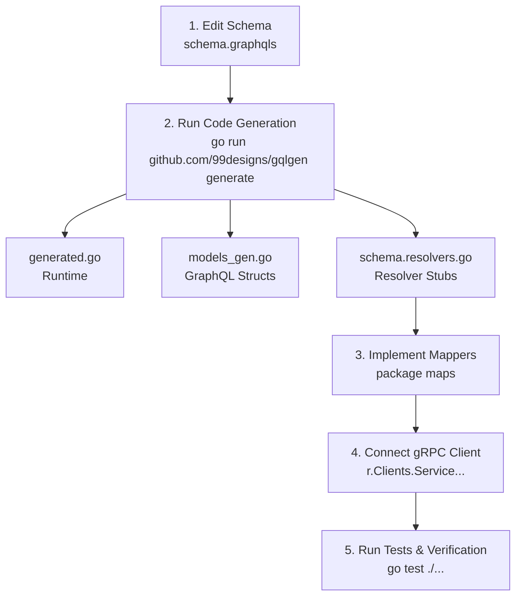

# GraphQL Development & gqlgen Code Generation Guide

This guide details the GraphQL architecture, code generation workflow, and step-by-step instructions for creating GraphQL queries and mutations from scratch in the **GoCart API Gateway**.

---

## 1. Quick Command Reference

### Primary Code Generation Command
To run `gqlgen` code generation from the `gateway/api-gateway` package:
```bash
cd gateway/api-gateway && go run github.com/99designs/gqlgen generate
```

### From Project Root
```bash
go run -C gateway/api-gateway github.com/99designs/gqlgen generate
```

---

## 2. Directory Structure & Configuration

### Package Organization
```
gateway/api-gateway/internal/graphql/
├── schema/
│   └── schema.graphqls         # GraphQL SDL schema definition
├── generated/
│   └── generated.go            # Auto-generated gqlgen execution runtime (DO NOT EDIT)
├── model/
│   └── models_gen.go           # Auto-generated GraphQL Go structs (DO NOT EDIT)
├── mappers/                    # Protobuf -> GraphQL DTO Mappers (package maps)
│   ├── cart_map.go
│   ├── order_map.go
│   ├── product_map.go
│   └── user_map.go
├── mutations/                  # GraphQL Mutation implementations (package mutation)
│   ├── cart_mutation.go
│   ├── login_mutation.go
│   ├── mutation.go
│   ├── order_mutation.go
│   ├── product_mutation.go
│   └── register_mutation.go
└── resolvers/                  # GraphQL Query & Schema Resolvers (package resolvers)
    ├── auth_resolver.go
    ├── cart_resolver.go
    ├── order_resolver.go
    ├── product_resolver.go
    ├── products_resolver.go
    ├── resolver.go
    ├── schema.resolvers.go      # Generated resolver stubs
    └── user_resolver.go
```

### `gqlgen.yml` Setup
The generation process is configured via `gateway/api-gateway/gqlgen.yml`:
```yaml
schema:
  - internal/graphql/schema/schema.graphqls

exec:
  filename: internal/graphql/generated/generated.go
  package: generated

model:
  filename: internal/graphql/model/models_gen.go
  package: model

resolver:
  layout: follow-schema
  dir: internal/graphql/resolvers
  package: resolvers
  filename_template: "{name}.resolvers.go"
```

---

## 3. Step-by-Step Workflow: Creating a Resolver from Scratch



### Step 1: Define Schema Types & Fields
Add your GraphQL Types, Inputs, Queries, or Mutations in `gateway/api-gateway/internal/graphql/schema/schema.graphqls`:

```graphql
type Coupon {
  id: String!
  code: String!
  discountPercent: Float!
  active: Boolean!
}

input CreateCouponInput {
  code: String!
  discountPercent: Float!
}

type Query {
  health: String!
  version: String!
  coupon(id: String!): Coupon
}

type Mutation {
  createCoupon(input: CreateCouponInput!): Coupon!
}
```

### Step 2: Auto-Generate Code
Run the generation command:
```bash
cd gateway/api-gateway && go run github.com/99designs/gqlgen generate
```
`gqlgen` will:
- Recompile `internal/graphql/generated/generated.go`.
- Regenerate Go data models in `internal/graphql/model/models_gen.go`.
- Append stub functions to `internal/graphql/resolvers/schema.resolvers.go`.

### Step 3: Implement Data Mappers
In `internal/graphql/mappers/`, add functions to map gRPC Protobuf structures to GraphQL payloads:

```go
package maps

import "github.com/marees-godev/GoCart-Server/gateway/api-gateway/internal/grpc/pb/couponpb"

func MapCoupon(c *couponpb.Coupon) map[string]interface{} {
	if c == nil {
		return nil
	}
	return map[string]interface{}{
		"id":              c.Id,
		"code":            c.Code,
		"discountPercent": c.DiscountPercent,
		"active":          c.Active,
	}
}
```

### Step 4: Implement Resolver Functions
In `internal/graphql/resolvers/schema.resolvers.go`, replace stub panics with calls to the gRPC client layer (`r.Clients`):

```go
package resolvers

import (
	"context"

	maps "github.com/marees-godev/GoCart-Server/gateway/api-gateway/internal/graphql/mappers"
	"github.com/marees-godev/GoCart-Server/gateway/api-gateway/internal/graphql/model"
	appErrors "github.com/marees-godev/GoCart-Server/pkg/errors"
)

// Coupon is the resolver for the coupon field.
func (r *queryResolver) Coupon(ctx context.Context, id string) (*model.Coupon, error) {
	if r.Clients == nil || r.Clients.CouponClient == nil {
		return nil, appErrors.Internal(nil, "coupon client unavailable")
	}

	res, err := r.Clients.CouponClient.GetCoupon(ctx, &couponpb.GetCouponRequest{Id: id})
	if err != nil {
		return nil, err
	}

	return &model.Coupon{
		ID:              res.Coupon.Id,
		Code:            res.Coupon.Code,
		DiscountPercent: res.Coupon.DiscountPercent,
		Active:          res.Coupon.Active,
	}, nil
}
```

### Step 5: Verification
Run tests and build checks:
```bash
cd gateway/api-gateway
go test ./...
go build ./...
```

---

## 4. Troubleshooting & Best Practices

| Symptom | Cause | Solution |
| :--- | :--- | :--- |
| `packages.Load: found packages X and Y` | Inconsistent package declarations in a single directory | Ensure all `.go` files in `internal/graphql/resolvers/` state `package resolvers`. |
| `undefined: maps.MapProduct` | Package import name mismatch | Import `"github.com/marees-godev/GoCart-Server/gateway/api-gateway/internal/graphql/mappers"` and invoke `maps.MapProduct`. |
| Schema out-of-sync error | Schema modified without running `gqlgen` | Execute `go run github.com/99designs/gqlgen generate`. |
| Direct DB access in resolver | Architecture violation | Resolvers must only call gRPC clients (`r.Clients`). No SQL/DB operations belong in API Gateway resolvers. |
